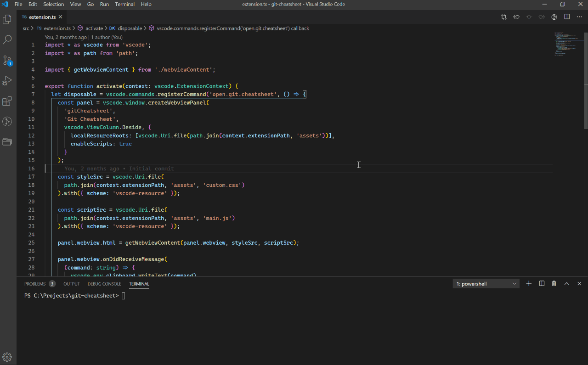

# Git Cheatsheet ([link](https://marketplace.visualstudio.com/items?itemName=dzhavat.git-cheatsheet))

VS Code extension that lets you open a Git cheatsheet directly in the editor.

## Features

To open the cheatsheet press `Ctrl+Shift+P` (Win, Linux) / `Cmd+Shift+P` (Mac) and search for the `Open Git Cheatsheet` command.

You can also copy each command by clicking on the “Copy” button on the right.

The colors on the cheatsheet page automatically adapt to the selected theme. The font is based on the user’s preferred font family.

## Support my work

If you find this extension useful and would like to support my work, you can [buy me a cup of tea](https://www.buymeacoffee.com/dzhavat). Thank you!

## Demo

#### Using the `Open Git Cheatsheet` command

## Credit

Git Logo by [Jason Long](https://twitter.com/jasonlong) is licensed under the [Creative Commons Attribution 3.0 Unported License](https://creativecommons.org/licenses/by/3.0/).